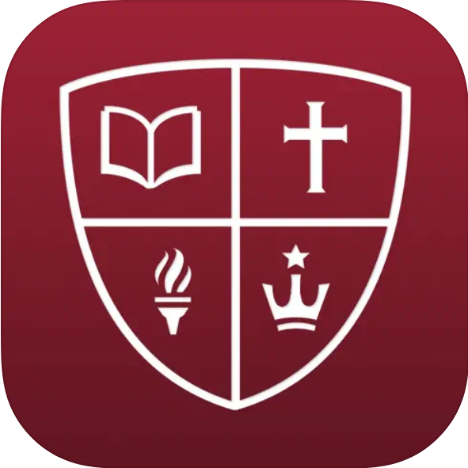

    

        
    

<h1 style="text-align: center">   Hello I'm Micah! I am a software engineer and artist passionate about learning, science, and communication.     </h1>

<h1 style="text-align: center">Projects:</h1>

    
    <h3><a href="https://apps.apple.com/us/app/westmont/id6538728714">Westmont College Mobile App</a></h3>
    
I lead a team at CATLab to create Westmont College's mobile app, which is used by most of the students on campus to see news, the dining menu, and the student directory.

    
    <h3><a href="https://github.com/MicahHoward/Manki">Manki</a></h3>
    
For my senior project, I created an app inspired by Anki to help people retain math skills, using C++, wxWidgets, and sqlite. It utilizes the <a href="https://github.com/open-spaced-repetition/fsrs4anki/wiki/The-Algorithm">FSRS</a> algorithm to predict when a user might forget the skill, and then it generates a math problem for them to solve.

    <h3>Admissions Automation - </h3>
    
I created a program to automate data processing from various sources, such as Common App or the SAT, to a standardized format for input into Salesforce, saving admissons workers multiple hours of work per day.

